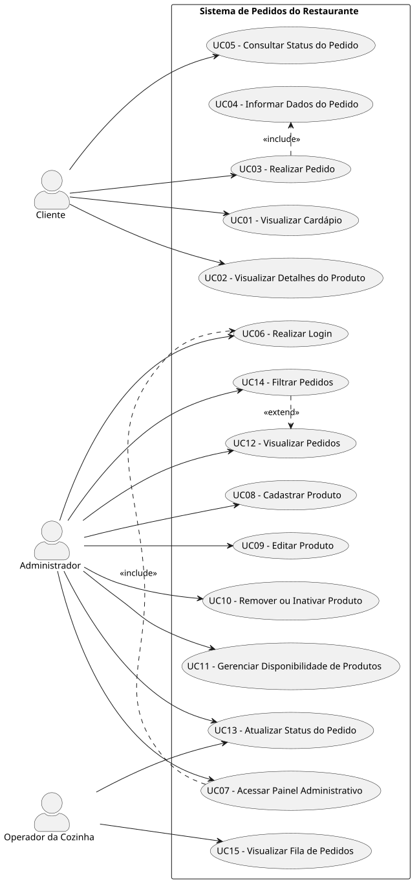

# Diagrama de Caso de Uso

O diagrama de caso de uso apresenta as interações entre os atores do sistema e as principais funcionalidades disponíveis na aplicação.

## Atores do Sistema

- Cliente
- Administrador
- Operador da Cozinha

## Diagrama

## Descrição

O ator **Cliente** pode visualizar o cardápio, consultar detalhes dos produtos, realizar pedidos e consultar o status do pedido.

O ator **Administrador** é responsável pelo login, acesso ao painel administrativo, cadastro, edição, remoção ou inativação de produtos, gerenciamento da disponibilidade, visualização de pedidos, filtragem e atualização do status.

O ator **Operador da Cozinha** pode visualizar a fila de pedidos e atualizar o status dos pedidos em andamento.

O relacionamento `<<include>>` foi utilizado nos casos em que uma funcionalidade depende obrigatoriamente de outra, como em **Realizar Pedido**, que inclui **Informar Dados do Pedido**, e em **Acessar Painel Administrativo**, que inclui **Realizar Login**.

O relacionamento `<<extend>>` foi utilizado em **Filtrar Pedidos**, por representar uma funcionalidade complementar à visualização de pedidos.