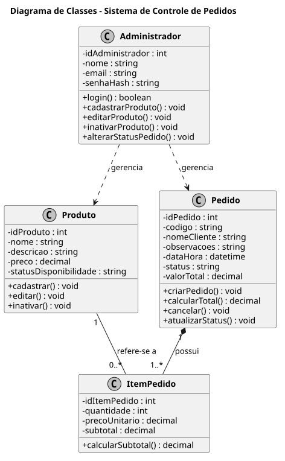

# Diagrama de Classes

O diagrama de classes representa a estrutura do sistema de controle de pedidos, mostrando as entidades principais, seus atributos e os relacionamentos entre elas.

As principais classes do sistema são:

- Administrador
- Produto
- Pedido
- ItemPedido

## Diagrama UML

## Descrição das Classes

### Administrador
Responsável pela administração do sistema. Pode realizar login, cadastrar produtos, editar produtos e atualizar o status dos pedidos.

### Produto
Representa os itens disponíveis no cardápio do restaurante.

### Pedido
Representa um pedido realizado por um cliente.

### ItemPedido
Representa cada item presente dentro de um pedido, relacionando produtos e quantidades.