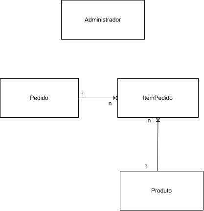
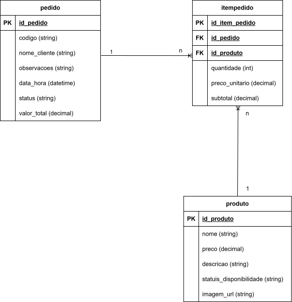

# Modelagem do Banco de Dados

Este documento apresenta a modelagem do banco de dados do sistema web de pedidos para restaurante/pizzaria.

## Modelagem Simples

A modelagem simples representa as principais entidades do sistema e seus relacionamentos.

## Modelagem Detalhada

A modelagem detalhada apresenta as tabelas, atributos, chaves primárias e chaves estrangeiras.

## Entidades Principais

### Pedido
Armazena as informações gerais do pedido realizado pelo cliente, incluindo identificação, contato, modalidade de entrega e dados de endereço quando aplicável.

### Produto
Armazena os produtos disponíveis no cardápio.

### ItemPedido
Representa os itens vinculados a cada pedido, resolvendo o relacionamento entre pedido e produto.

## Atributos das Entidades

### Pedido
- id_pedido (PK)
- codigo
- nome_cliente
- telefone_cliente
- tipo_entrega
- rua_entrega
- numero_entrega
- bairro_entrega
- complemento_entrega
- observacoes
- data_hora
- status
- valor_total

### Produto
- id_produto (PK)
- nome
- preco
- descricao
- status_disponibilidade
- imagem_url

### ItemPedido
- id_item_pedido (PK)
- id_pedido (FK)
- id_produto (FK)
- quantidade
- preco_unitario
- subtotal

## Relacionamentos

- Um pedido pode possuir vários itens de pedido.
- Um produto pode estar presente em vários itens de pedido.
- Cada item de pedido pertence a um único pedido e referencia um único produto.

## Regras Aplicadas na Modelagem

- O campo `codigo` em `Pedido` é único, garantindo a identificação individual de cada pedido.
- O campo `tipo_entrega` em `Pedido` aceita apenas os valores `entrega` ou `retirada`.
- Quando o tipo de entrega for `entrega`, os campos `rua_entrega`, `numero_entrega` e `bairro_entrega` tornam-se obrigatórios.
- Quando o tipo de entrega for `retirada`, os campos de endereço podem permanecer nulos.
- O campo `status` em `Pedido` aceita apenas os estados definidos no fluxo operacional do sistema.
- O campo `subtotal` em `ItemPedido` é calculado automaticamente a partir de `quantidade * preco_unitario`.

## Considerações

- A tabela `ItemPedido` resolve o relacionamento muitos-para-muitos entre `Pedido` e `Produto`.
- O preço do produto é armazenado em `ItemPedido` por meio do campo `preco_unitario`, preservando o valor praticado no momento do pedido.
- O campo `imagem_url` em `Produto` permite exibir imagens dos produtos no frontend.
- O campo `data_hora` em `Pedido` permite controle e histórico dos pedidos.
- O campo `telefone_cliente` possibilita contato com o cliente para suporte, confirmação ou entrega.
- O campo `tipo_entrega` permite diferenciar pedidos para entrega e retirada.
- Os campos de endereço associados ao pedido permitem registrar o local de entrega sem necessidade de uma tabela separada no MVP.

## Observação

Após a atualização do schema, os diagramas visuais de modelagem (`modelagem_banco_simples` e `modelagem_banco_detalhada`) também devem ser revisados para refletir os novos atributos da entidade `Pedido`.