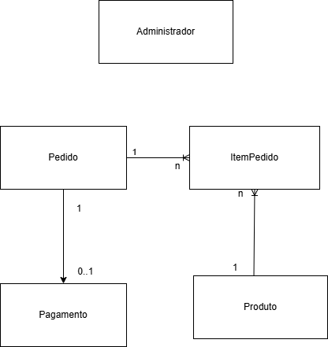
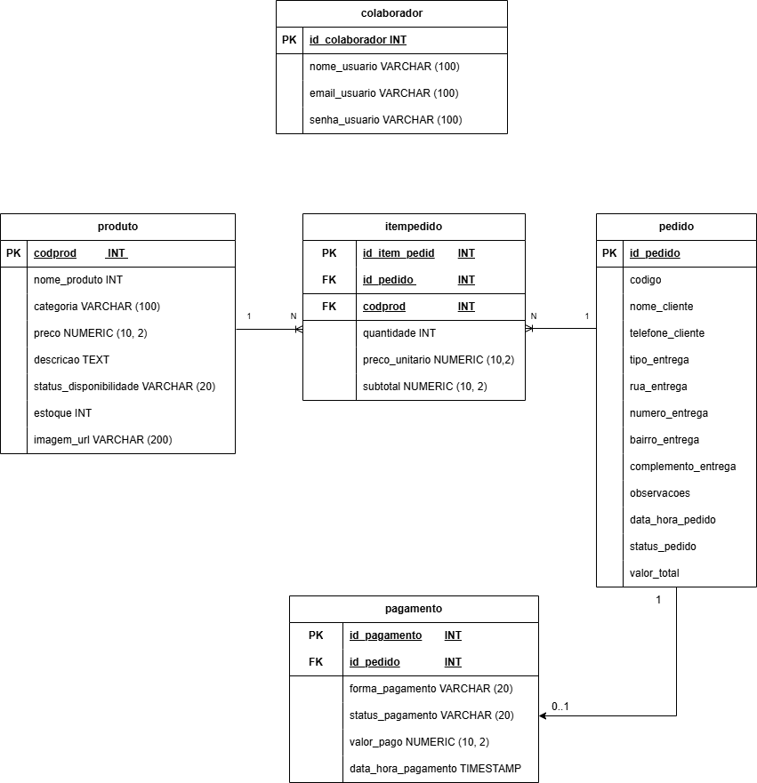

# Modelagem do Banco de Dados

Este documento apresenta a modelagem do banco de dados do MVP de pedidos para pizzaria/restaurante.

## Modelagem Simples

## Modelagem Detalhada

## Contexto do MVP

O cliente nao faz login para criar um pedido. O fluxo do cliente e:

Cardapio -> Detalhe do Produto -> Carrinho -> Checkout -> Pedido Confirmado

Por isso, a tabela `pedido` guarda diretamente os dados basicos informados no checkout, como nome, telefone e endereco de entrega quando houver.

## Entidades Principais

### Colaborador

Representa o usuario administrativo que acessa o painel admin.

### Cliente

Tabela mantida apenas para evolucao futura. Ela nao e obrigatoria para criar pedidos no MVP atual.

### Produto

Armazena os produtos exibidos no cardapio, incluindo categoria, preco, imagem, estoque e disponibilidade.

### Pedido

Armazena as informacoes gerais do pedido realizado sem login, incluindo contato do cliente, modalidade de entrega, endereco quando aplicavel, status operacional e valor total.

### Pagamento

Representa a forma e o status do pagamento associado a um pedido. No MVP, nao ha processamento real de pagamento; a tabela registra apenas a forma escolhida e o status operacional.

### ItemPedido

Representa os produtos vinculados a cada pedido, guardando a quantidade, o preco unitario praticado no momento do pedido e o subtotal.

## Atributos das Entidades

### Colaborador

- id_colaborador (PK)
- nome_usuario
- email_usuario
- senha_usuario

### Cliente

- id_cliente (PK)
- nome_cliente
- cpf_cliente
- celular_cliente
- email_cliente
- senha_cliente

### Produto

- codprod (PK)
- nome_produto
- categoria
- preco
- descricao
- status_disponibilidade
- estoque
- imagem_url

### Pedido

- id_pedido (PK)
- codigo
- nome_cliente
- telefone_cliente
- tipo_entrega
- rua_entrega
- numero_entrega
- bairro_entrega
- complemento_entrega
- observacoes
- data_hora_pedido
- status_pedido
- valor_total

### Pagamento

- id_pagamento (PK)
- id_pedido (FK)
- forma_pagamento
- status_pagamento
- valor_pago
- data_hora_pagamento

### ItemPedido

- id_item_pedido (PK)
- id_pedido (FK)
- codprod (FK)
- quantidade
- preco_unitario
- subtotal

## Relacionamentos

- Um pedido pode possuir varios itens de pedido.
- Um produto pode estar presente em varios itens de pedido.
- Cada item de pedido pertence a um unico pedido e referencia um unico produto.
- Um pedido pode ter no maximo um pagamento associado.
- Um pagamento pertence a um unico pedido.
- Pagamento se relaciona com pedido por `id_pedido`.
- Cliente nao se relaciona obrigatoriamente com pedido no MVP atual.

## Regras Aplicadas

- `produto.categoria` aceita `pizza`, `doce`, `bebida` ou `combo`.
- `produto.status_disponibilidade` aceita `disponivel` ou `indisponivel`.
- `pedido.tipo_entrega` aceita `entrega` ou `retirada`.
- Quando `pedido.tipo_entrega` for `entrega`, rua, numero e bairro devem ser preenchidos.
- `pedido.status_pedido` segue o fluxo do admin: `recebido`, `em_preparo`, `pronto`, `finalizado` e `cancelado`.
- `pagamento.forma_pagamento` aceita `dinheiro`, `cartao` ou `pix`.
- `pagamento.status_pagamento` aceita `pendente`, `pago` ou `cancelado`.
- `pagamento.valor_pago` nao pode ser negativo.
- No MVP, `pagamento.status_pagamento` inicia como `pendente`.
- Nao ha integracao real com gateway de pagamento.
- `itempedido.preco_unitario` preserva o preco praticado no momento do pedido.
- `itempedido.subtotal` guarda o total daquele item do pedido.

## Observacao

Os diagramas visuais de modelagem em `diagrams/` devem ser revisados para refletir os nomes e atributos atuais do schema.
