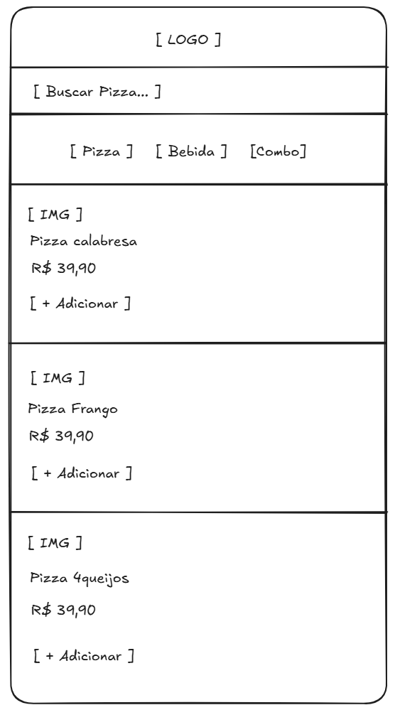
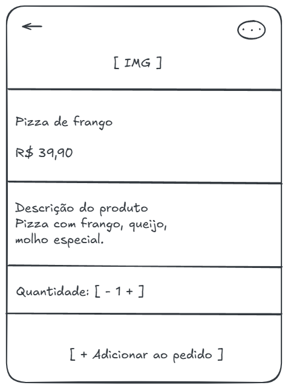

# Wireframes do Sistema

Este documento apresenta os wireframes desenvolvidos para o sistema de controle de pedidos, com foco na experiência do usuário (UX) e na definição das principais telas.

---

## Tela: Cardápio (Lista de Produtos)

### Objetivo

Permitir que o cliente visualize os produtos disponíveis de forma rápida, simples e intuitiva, facilitando a escolha e o início do pedido.

---

### Decisões de UX

- Abordagem mobile-first
- Layout em lista vertical
- Navegação por scroll contínuo
- Interface simples e limpa
- Foco na ação principal: realizar pedido

---

### Estrutura da Tela

- Header com identificação do sistema
- Campo de busca
- Filtro por categorias (pizza, bebida, combo)
- Lista de produtos em formato de cards

---

### Estrutura do Card de Produto

Cada produto contém:
- Imagem
- Nome
- Preço
- Botão “+ Adicionar”

---

### Comportamento do Usuário

- Clique no card abre a tela de detalhe do produto
- Clique no botão “+ Adicionar” adiciona diretamente ao pedido
- Navegação contínua por scroll

---

### Feedback Visual

- Alteração visual ao adicionar produto
- Confirmação da ação realizada

---

### Decisões Estratégicas

- Não utilizar banners promocionais pesados
- Não incluir funcionalidades fora do MVP
- Priorizar usabilidade e rapidez

---

### Integração com o Sistema

- Utiliza dados da tabela `produto`
- Atende à user story US06
- Inicia o fluxo de pedido
- Conecta com a tela de detalhe do produto

---

### Wireframe

---

### Critério de Sucesso

- Usuário consegue visualizar os produtos rapidamente
- Usuário entende o que está disponível
- Usuário consegue iniciar um pedido com poucos cliques
- Interface clara, simples e funcional

---

## Tela: Detalhe do Produto

### Objetivo

Permitir que o usuário visualize informações detalhadas de um produto e o adicione ao pedido de forma simples e rápida.

### Estrutura da Tela

- Imagem do produto em destaque
- Nome e preço
- Descrição
- Controle de quantidade
- Botão de ação “Adicionar ao pedido”

### Wireframe

