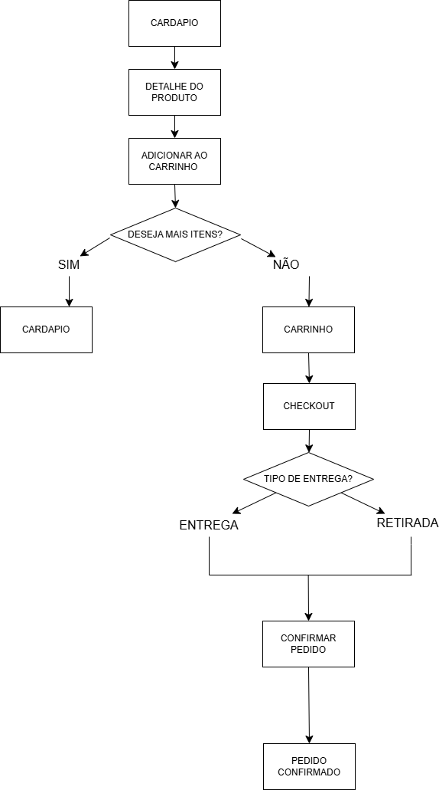
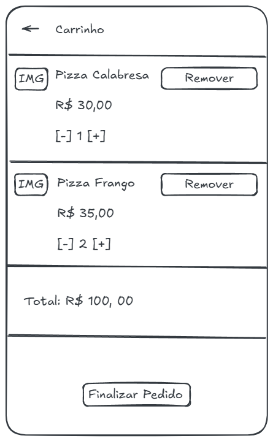
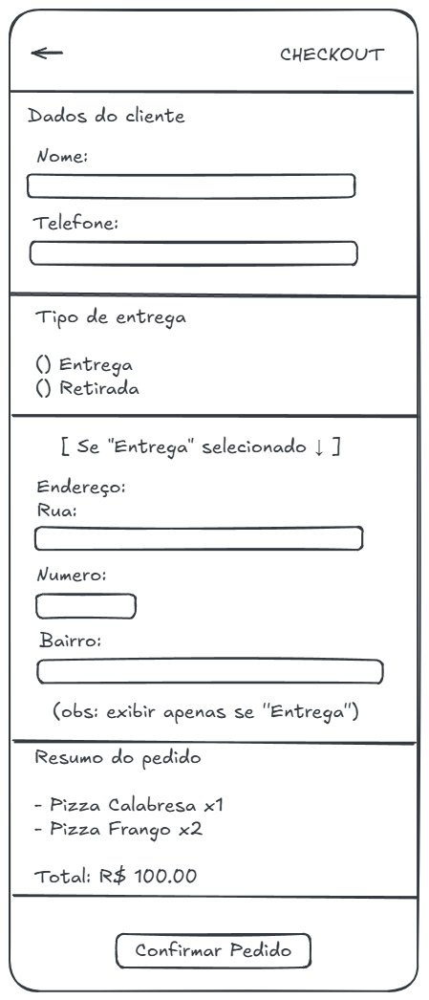

# Wireframes do Sistema

Este documento apresenta os wireframes do sistema de pedidos, com foco na experiência do usuário (UX) e na definição das principais telas.

---

# Fluxo de Navegação do Usuário (User Flow)

## Objetivo
Representar a jornada do usuário do cardápio até a confirmação do pedido.

## Diagrama

## Fluxo Resumido
Cardápio → Detalhe → Carrinho → Checkout → Pedido Confirmado

## Fluxo Detalhado

Cardápio → Detalhe → Adicionar ao carrinho  
↳ Continuar comprando?  
• Sim → volta ao Cardápio  
• Não → Carrinho  

Carrinho → Finalizar Pedido → Checkout  
↳ Tipo de entrega?  
• Entrega → preencher endereço  
• Retirada → sem endereço  

→ Confirmar Pedido → Pedido Confirmado  

## Decisões de UX

- Navegação contínua (loop de compra)
- Checkout simplificado em uma única tela
- Endereço exibido apenas quando necessário
- Sistema sem login (MVP)

---

# Telas do Sistema

## Tela: Cardápio

### Wireframe

### Objetivo
Permitir visualizar produtos e iniciar o pedido rapidamente.

### Elementos
- Lista de produtos
- Campo de busca
- Filtros
- Cards com imagem, nome, preço e ação

### Ações
- Abrir detalhe do produto
- Adicionar direto ao carrinho
- Navegar por scroll

### Observações de UX
- Layout simples e direto
- Foco na ação de compra
- Mobile-first

---

## Tela: Detalhe do Produto

### Wireframe

### Objetivo
Exibir informações do produto e permitir adicioná-lo ao pedido.

### Elementos
- Imagem
- Nome e preço
- Descrição
- Controle de quantidade
- Botão de ação

### Ações
- Ajustar quantidade
- Adicionar ao carrinho

---

## Tela: Carrinho

### Wireframe

### Objetivo
Permitir revisão do pedido antes da finalização.

### Elementos
- Lista de itens
- Controles de quantidade
- Botão remover
- Total do pedido
- Botão “Finalizar Pedido”

### Ações
- Alterar quantidade
- Remover itens
- Avançar para checkout

### Observações de UX
- Interface simples e clara
- Foco na revisão do pedido

---

## Tela: Checkout

### Wireframe

### Objetivo
Finalizar o pedido com dados do cliente e tipo de entrega.

### Elementos
- Nome e telefone
- Opção de entrega ou retirada
- Campos de endereço (condicional)
- Resumo do pedido
- Total
- Botão de confirmação

### Ações
- Preencher dados
- Escolher tipo de entrega
- Confirmar pedido

### Regras de Negócio
- Nome e telefone obrigatórios
- Tipo de entrega obrigatório
- Endereço obrigatório apenas para entrega

### Observações de UX
- Seções bem separadas
- Exibição condicional evita excesso de informação

---

## Tela: Pedido Confirmado

### Wireframe

### Objetivo

Confirmar ao usuário que o pedido foi realizado com sucesso, exibindo um resumo simples da compra.

### Elementos da Tela

- Mensagem de confirmação
- Resumo do pedido (itens e quantidades)
- Valor total
- Botão de retorno ao cardápio

### Ações do Usuário

- Visualizar confirmação do pedido
- Conferir itens e valor total
- Retornar ao cardápio para novo pedido

### Regras de Negócio

- A tela deve ser exibida após a confirmação do pedido
- O sistema deve apresentar os itens do pedido realizado
- O valor total deve ser exibido corretamente
- O usuário deve ter opção de retornar ao fluxo principal

### Observações de UX

- Tela simples e direta, focada na confirmação
- Evita excesso de informações desnecessárias
- Exibe apenas o essencial para garantir clareza ao usuário
- Botão de ação posicionado ao final da tela